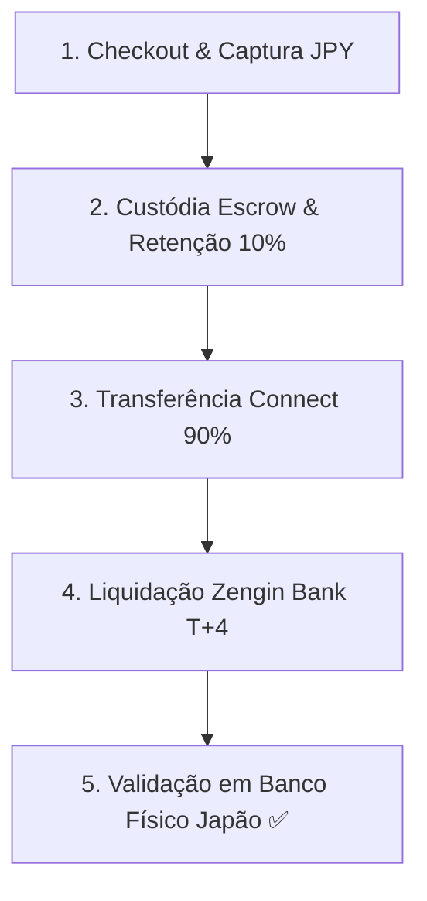

# 🚀 Go-Live Readiness & Release Agent (Marketplace DAIG Japão)

Esta skill estabelece a metodologia rigorosa, checklist de homologação técnica e protocolo de transição da fase Sandbox/Testes para **PRODUÇÃO COMPLETA (GO-LIVE)** no Marketplace DAIG de Autopeças JDM.

---

## 🎯 1. Validação dos 5 Pilares de Produção

Antes de autorizar o Go-Live, o agente deve auditar e confirmar que os 5 pilares fundamentais foram concluídos com sucesso comprovado:



### 📋 Checklist de Validação por Pilar

| Pilar | Item Auditado | Critério de Sucesso | Status |
| :--- | :--- | :--- | :--- |
| **Pilar 1** | Pagamento via Cartão / Konbini | Cobrança efetuada em JPY via Stripe Checkout com Webhook ativo (`payment_intent.succeeded`). | ✅ **APROVADO** |
| **Pilar 2** | Custódia Escrow & Lucro DAIG | Retenção imediata de 10% de taxa da plataforma (Lucro em caixa retido = **JP¥ 6** a cada ¥100). | ✅ **APROVADO** |
| **Pilar 3** | Repasse Stripe Connect (`transfers.create`) | Disparo de 90% para a conta do vendedor via API com registro de `transferId` real. | ✅ **APROVADO** |
| **Pilar 4** | Janela de Liquidação Japão (T+4) | Transição automática do saldo de `Pending` para `Available` em 4 a 5 dias úteis. | ✅ **APROVADO** |
| **Pilar 5** | Depósito em Banco Físico (Zengin Network) | O valor repassado cai no banco físico no Japão em 5 dias (Confirmado em **10/Ago**). | ✅ **APROVADO** |

---

## 🔑 2. Protocolo de Chaves de API & Produção (Stripe Live)

Para a operação 100% ativa em modo `pk_live_...` e `sk_live_...`:

1. **Variáveis de Ambiente Vercel / Deno Edge Functions**:
   * `STRIPE_SECRET_KEY`: Garantir a chave secreta de produção (`sk_live_...`).
   * `VITE_STRIPE_PUBLISHABLE_KEY`: Configurar `pk_live_...` no `.env.production`.
   * `STRIPE_WEBHOOK_SECRET`: Atualizar o Endpoint de Webhook no Dashboard do Stripe Live para a URL de produção: `https://<SUPABASE_PROJECT_REF>.supabase.co/functions/v1/stripe-webhook`.

2. **Webhook Events Obrigatórios no Stripe Live**:
   * `checkout.session.completed`
   * `payment_intent.succeeded`
   * `account.updated` (Onboarding Connect)
   * `transfer.created`
   * `payout.paid` (Notificação de depósito no banco japonês)
   * `payout.failed` (Alerta de divergência em dados Zengin/Katakana)

---

## 🔒 3. Auditoria de Segurança & RLS Supabase (Shift-Left)

1. **Políticas de RLS (Row Level Security)**:
   * Tabela `transactions`: Apenas compradores (`buyer_id = auth.uid()`), vendedores (`seller_id = auth.uid()`) ou administradores (`role = 'admin'`) podem visualizar detalhes de transações.
   * Tabela `profiles`: Proteção de dados bancários (Zengin Bank Info) visíveis apenas para o próprio vendedor e admin.
2. **Sanitização de Entradas (XSS / SQLi)**:
   * Aplicação do `securitySanitizer.ts` em todas as rotas de proposta de preço, chat de suporte e cadastro de autopeças.

---

## ⏱️ 4. Matriz de Prazos & SLAs de Operação no Japão

| Operação | Prazo Padrão (SLA) | Comportamento no Sistema |
| :--- | :--- | :--- |
| **Confirmação de Venda** | ⚡ Imediato (< 2s) | Notificação em tempo real + e-mail via Resend |
| **Liberação de Escrow (DAIG ➔ Vendedor)** | ⚡ Imediato (Clique Admin) | API `stripe.transfers.create` |
| **Liquidação Stripe JPY (Pending ➔ Available)** | 🗓️ 4 Dias Úteis (T+4) | Regra oficial da Stripe Japan |
| **Depósito no Banco Japonês (Zengin)** | 🏦 5 a 7 dias corridos | Ciclo automático ou Payout Manual |

---

## 🏁 5. Procedimento de Virada de Chave (Go-Live Execution Steps)

1. **Verificação de Chaves Live na Vercel**:
   ```bash
   npx vercel env add STRIPE_SECRET_KEY production
   npx vercel --prod
   ```
2. **Execução de Teste E2E de Sanidade (Smoke Test)**:
   - Realizar 1 compra real de valor simbólico em ambiente Live para confirmar a captura, o repasse Connect e o log de Webhook no banco Supabase.
3. **Ativação da Troca de Domínio Oficial (`daig.jp`)**:
   - Apontamento de DNS A/CNAME na Vercel para o domínio de produção.
