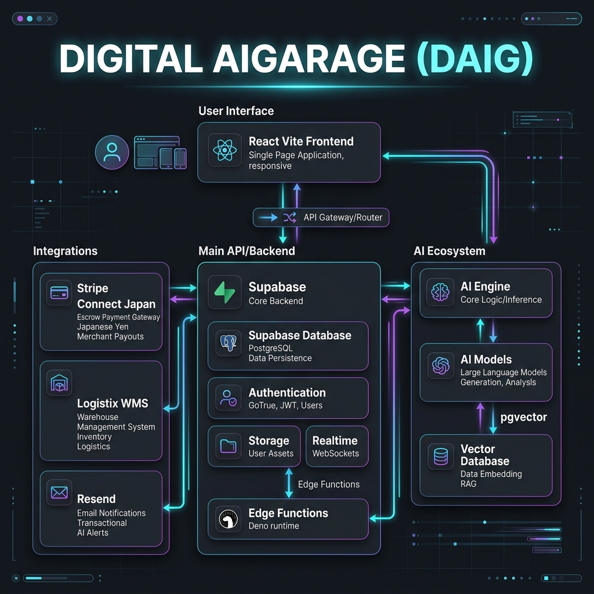
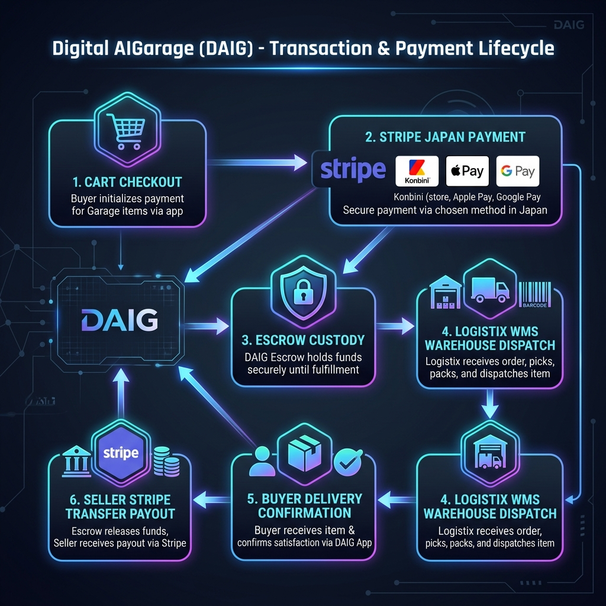

# Digital AIGarage (DAIG) - Arquitetura de Software e Fluxo de Plataforma

Este documento descreve a arquitetura técnica, os microsserviços e os fluxos de transação da plataforma **Digital AIGarage (DAIG)** no mercado de autopeças do Japão.

---

## 🏛️ 1. Arquitetura do Sistema

A **Digital AIGarage (DAIG)** é construída sobre uma arquitetura moderna serverless e orientada a eventos, combinando alta performance de front-end com microsserviços em Edge Computing e custódia segura de pagamentos.

### 📦 Componentes Principais:
1. **Frontend App (React + Vite + TypeScript):**
   * Interface responsiva de alta fidelidade para Compradores e Vendedores B2B/B2C.
   * Visualização 3D interativa de componentes automotivos (Three.js / React Three Fiber).
   * Tradução automática e suporte multilíngue (Português, Inglês, Japonês).

2. **Supabase Core & Database (PostgreSQL + Auth + Storage):**
   * Banco de dados relacional PostgreSQL com extensão `pgvector` para buscas semânticas de autopeças.
   * Controle de Acesso Baseado em Funções (RLS - Row Level Security) separando Compradores, Vendedores e Administradores.
   * Supabase Auth (OAuth 2.0 com Google Auth).

3. **Supabase Edge Functions (Deno / TypeScript Runtime):**
   * **`/stripe-checkout`**: Criação de sessões dinâmicas no Stripe com moedas JPY, suporte a Konbini, Apple Pay e Google Pay.
   * **`/stripe-webhook`**: Interceptação de eventos de pagamento assíncronos (`checkout.session.async_payment_succeeded` e `failed`).
   * **`/transactions`**: Liberação de custódia segura (Stripe Connect Escrow Payouts) quando o comprador confirma o recebimento.
   * **`/notifications`**: Microsserviço de envio de e-mails transacionais via API do Resend.

4. **Stripe Connect Japan Gateway:**
   * Processamento em Yen Japonês (JPY - ¥).
   * Suporte nativo a **Konbini** (Lojas de Conveniência: 7-Eleven, Lawson, FamilyMart), **Apple Pay**, **Google Pay** e Cartões.
   * Custódia financeira (Escrow retention) até a homologação da entrega.

5. **Logistix WMS & Transportes:**
   * Motor de logística integrada para cotação, rastreamento e expedição com transportadoras japonesas (Yamato Transport, Sagawa Express, Japan Post).

---

## 🔄 2. Fluxo da Transação e Ciclo de Vida do Pagamento (Konbini & Escrow)

Abaixo é apresentado o fluxo de vida completo de uma compra na plataforma DAIG, cobrindo o método Konbini e a retenção de custódia.

### 📋 Etapas do Fluxo de Compra:
1. **Cart Checkout:** O comprador seleciona a autopeça e inicia o checkout na moeda JPY (¥).
2. **Stripe Japan Payment:**
   * **Cartão / Apple Pay / Google Pay:** Confirmação instantânea (`payment_status = 'paid'`), a peça muda para `sold` e vai para custódia.
   * **Konbini (Loja de Conveniência):** Gera o código de barras/voucher com validade de 3 dias. A peça fica reservada (`payment_status = 'pending_payment'`, `parts.status = 'pending'`).
3. **Escrow Custody:** O valor pago fica retido na conta principal da plataforma (Stripe Connect).
4. **Logistix WMS Dispatch:** O vendedor prepara e despacha o pacote via transportadora.
5. **Buyer Delivery Confirmation:** O comprador recebe a encomenda e confirma a satisfação no app.
6. **Seller Payout:** A Edge Function transfere o valor líquido do vendedor (`seller_net`) via Stripe Connect (`/v1/transfers`).

---

## 📊 3. Mapeamento de Arquivos de Configuração (.env)

Todas as variáveis de ambiente da infraestrutura foram auditadas e exportadas na planilha Excel:
* 📄 **Caminho da Planilha:** [`docs/diag/env_configuracoes.xlsx`](file:///home/lswitch/car-parts-marketplce/docs/diag/env_configuracoes.xlsx)
