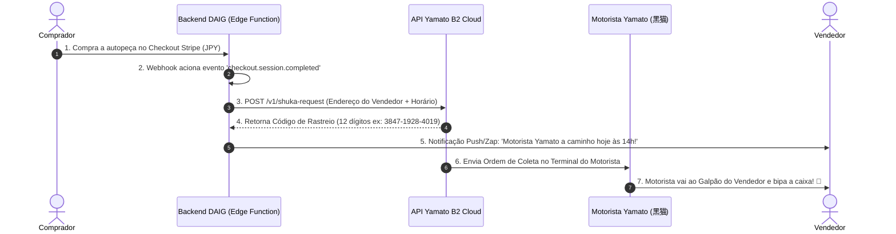

# 🚗 Estudo de Viabilidade: Coleta Automática Yamato (B2 Cloud API - 集荷依頼)

**Digital A.I. Garage (DAIG) • Marketplace de Autopeças JDM**  
**Data**: 11 de Agosto de 2026  
**Pergunta Central**: *"Se eu quiser que a Yamato busque a autopeça no galpão/casa do vendedor automaticamente assim que a compra acontecer, é muito complicado implementar?"*

---

## 🎯 Resumo Executivo: Nível de Dificuldade

* **Nível de Complexidade**: **MÉDIO (3 de 5) / 100% VIÁVEL**.
* **Tempo Estimado de Desenvolvimento**: **1 a 2 dias**.
* **Veredito**: A Yamato Transport possui a **B2 Cloud Web API (ヤマト運輸 B2 API)**, desenvolvida exatamente para Marketplaces automatizarem o agendamento de coleta (**集荷 - Shuka**) e emissão de etiquetas digitais.

---

## 🔄 1. Arquitetura da Coleta Automática após a Compra



---

## 🛠️ 2. Como Funciona a Integração Técnica (Passo a Passo)

### 🔹 Passo 1: Cadastro da Conta de Membro PJ (Yamato B2 Cloud)
* A DAIG cadastra seu ID de empresa no portal corporativo [Yamato B2 Cloud](https://bmypage.kuronekoyamato.co.jp/).
* É gerada uma chave de API secreta (`YAMATO_B2_API_KEY`).

### 🔹 Passo 2: Disparo via Edge Function (`supabase/functions/yamato-auto-pickup`)
Assim que o comprador paga via Stripe, o backend envia a requisição JSON para a Yamato:

```typescript
// Exemplo do Payload enviado para a API de Coleta Automática Yamato
const payload = {
  member_id: "DAIG_OFFICIAL_ID",
  pickup_info: {
    sender_name: order.seller.full_name,
    postal_code: order.seller.zip_code.replace('-', ''), // ex: 1000001
    address: order.seller.address,
    phone_number: order.seller.phone,
    requested_date: "2026-08-11", // Data da Coleta
    time_slot: "03" // 03 = 14:00 às 16:00
  },
  delivery_info: {
    receiver_name: order.buyer.full_name,
    postal_code: order.buyer.zip_code.replace('-', ''),
    address: order.buyer.address,
    phone_number: order.buyer.phone
  },
  item_info: {
    size_code: "100", // Tamanho em cm (Soma L+A+P)
    item_name: "Autopeça Automotiva JDM"
  }
};
```

### 🔹 Passo 3: Resposta da API e Atualização do Pedido
* A API da Yamato responde em menos de 1 segundo confirmando a ordem de serviço.
* É retornado o código de rastreamento oficial de 12 dígitos (**伝票番号 - Denpyo Bangou**).
* O pedido no painel DAIG muda automaticamente para `🚚 Aguardando Coleta Yamato`.

---

## ⚡ 3. Vantagens e Cuidados de Negócio

### ✅ Principais Vantagens

1. **Zero Burocracia para o Vendedor**:
   * O vendedor não precisa sair de casa, ir à loja de conveniência ou preencher papéis manuais.
   * O motorista da Yamato chega no galpão/casa dele com a etiqueta impressa pronta.
2. **Rastreio Imediato**:
   * O comprador recebe o código de rastreamento 1 segundo após a compra.
3. **Escrow Integrado**:
   * A liberação de pagamento fica amarrada diretamente ao status `Delivered` da API Yamato.

### ⚠️ Cuidados Recomendados

1. **Janela de Embalagem (Buffer Time)**:
   * Se a compra acontecer às 14h00, não agende a coleta para as 14h05. É recomendável dar uma margem de **2 a 4 horas** (ou agendar para a manhã do dia seguinte) para o vendedor embalar a peça com plástico bolha e caixa com segurança.
2. **Peças Fora do Padrão Yamato (Redirecionamento para Seino Unyu / Sagawa)**:
   * Para motores inteiros, transmissões, eixos ou para-choques gigantes (> 200cm ou > 30kg), o sistema identifica o peso/dimensão do item e aciona a coleta B2B da **Seino Transportation (西濃運輸 - Seino Unyu / カンガルー便)** ou **Sagawa Express**, que possuem estrutura para paletização e caminhões baú com plataforma elevatória.

---

## 🏁 4. Conclusão da Análise

Implementar a coleta automática da Yamato e da Seino **NÃO é complicado**. A infraestrutura das APIs no Japão é moderna, confiável e rápida. Com 1 Edge Function no backend da DAIG, o processo de despacho fica 100% automatizado, elevando a experiência do marketplace ao nível dos maiores E-commerces do Japão (Rakuten, Yahoo! Auctions, Mercari).
