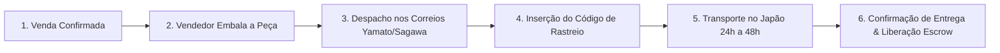
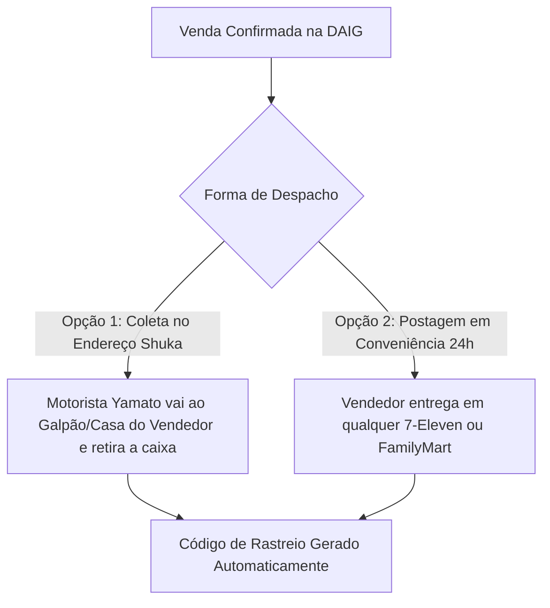
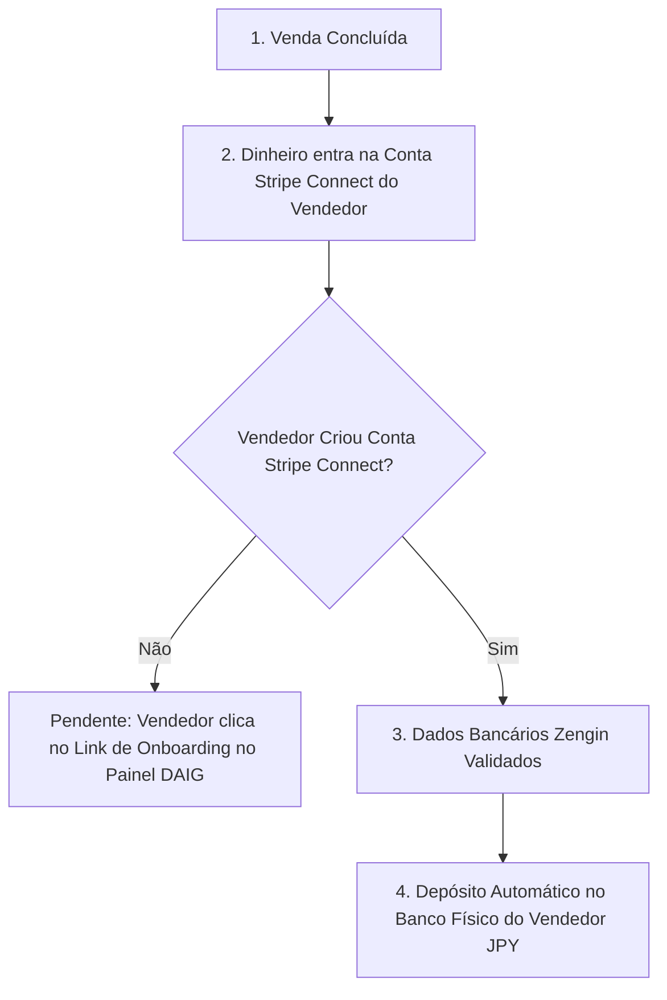

# 🚚 Guia de Logística, Rastreio e Otimização de Repasses Bancários no Japão

**Digital A.I. Garage (DAIG) • Marketplace de Autopeças JDM**  
**Data**: 11 de Agosto de 2026  
**Objetivo**: Explicação simples e direta do fluxo testado, logística de entrega pelos correios japoneses e estratégias para acelerar depósitos bancários.

---

## 📌 1. O que foi Testado e Aprovado (Status Atual)

Concluímos com sucesso o teste do **Ciclo de Pagamento e Liquidação Bancária**:

```
[ Comprador Paga JP¥ 100 ]
  ├── 1. Plataforma DAIG retém comissão (Lucro Líquido = JP¥ 6)
  ├── 2. Stripe Connect repassa 90% (JP¥ 90) para o Vendedor
  └── 3. O banco japonês recebeu o dinheiro no banco físico em 5 dias! ✅
```

---

## 📦 2. O que Falta Testar: Envio pelos Correios e Rastreamento

Após a compra, entra em cena a etapa de **Logística e Entrega da Peça Automotiva**.



### 🔹 As 3 Principais Transportadoras do Japão

| Transportadora | Nome em Japonês | Uso Principal no Marketplace DAIG | Prazo de Entrega no Japão |
| :--- | :--- | :--- | :--- |
| **Yamato Transport** | **Kuroneko Yamato (黑猫宅急便)** | Peças pequenas e médias (faróis, volantes, relógios, módulos) | ⚡ **24 horas (no dia seguinte)** na ilha de Honshu |
| **Sagawa Express** | **Sagawa Kyubin (佐川急便)** | Peças volumosas e pesadas (para-choques, portas, escapamentos, motores) | 🚚 **24 a 48 horas** |
| **Japan Post** | **Yu-Pack (日本郵便)** | Encomendas expressas padrão e envios regionais | 📦 **24 a 48 horas** |

---

### 🛵 2.1. Análise de Coleta em Casa / Galpão (集荷 - Shuka Service): Yamato vs. Japan Post

**Dúvida Frequente**: *"A transportadora retira a peça direto na casa do vendedor ou no galpão do desmanche?"*

**RESPOSTA: SIM! Tanto a Yamato quanto o Japan Post oferecem serviço de Coleta no Endereço (集荷 - Shuka).** No entanto, a **Yamato Kuroneko é altamente recomendada** pelas seguintes razões operacionais:



#### 🏆 Comparativo Técnico para o Marketplace DAIG:

| Critério Operacional | 📦 Yamato Transport (Kuroneko Yamato) | 📮 Japan Post (Yu-Pack) |
| :--- | :--- | :--- |
| **Retira na Casa / Galpão? (集荷 - Shuka)** | ✅ **SIM!** Com hora marcada (ex: 8h-12h, 14h-16h, 16h-18h, 18h-21h). | ✅ **SIM!** Agendamento via telefone ou site oficial. |
| **Integração de Coleta Automática via API** | 🚀 **IMPECÁVEL (`Yamato B2 Cloud API`)**. O vendedor clica em *"Solicitar Coleta"* no painel DAIG e a Yamato envia a ordem ao motorista. | ⚠️ Mais burocrático e exige preenchimento manual no site do correio. |
| **Postagem 24 horas por dia** | 🌙 **SIM!** Pode ser postado em qualquer **7-Eleven** ou **FamilyMart** (24h/365 dias). | 🕒 Limitado aos horários das agências do correio (fecham às 17h/19h) e postos Lawson. |
| **Limite de Tamanho e Peso** | 📏 Até **200 cm** (soma L+A+P) e até **30 kg** por caixa. | 📏 Até **170 cm** e até **25 kg** no pacote padrão. |

> 💡 **Recomendação Estratégica**:
> 1. **Yamato Kuroneko**: Opção padrão integrada no Marketplace DAIG para 90% dos envios (com suporte a coleta automática no galpão do vendedor e entrega de etiquetas com QR Code).
> 2. **Sagawa Express**: Utilizada como parceira oficial para autopeças gigantes que excedem 200 cm ou 30 kg (como motores inteiros, transmisiões e para-choques).
> 3. **Japan Post**: Mantida como opção secundária de envio.

### 🔹 Como Funciona o Código de Rastreamento (Denpyo Bangou)

1. O vendedor despacha o pacote via Coleta no Galpão (**Shuka**) ou entrega na loja de conveniência (**7-Eleven / FamilyMart**).
2. Ele recebe o código de 12 dígitos (**伝票番号 - Denpyo Bangou**), ex: `3847-1928-4019`.
3. O vendedor clica em *"Informar Envio"* no painel DAIG, seleciona a transportadora e cola o código.
4. O comprador e a plataforma acompanham o rastreamento em tempo real.

---

## 🔒 3. Como Funciona a Proteção Escrow e Liberação do Repasse

O dinheiro repassado ao vendedor fica protegido até a garantia de entrega:

* **Modo A - Liberação pelo Comprador**:
  * Ao receber o pacote em casa, o comprador abre a caixa, inspeciona a peça e clica em *"Confirmar Recebimento & Peça OK"*.
  * O dinheiro é liberado imediatamente para a **Conta Stripe Connect do Vendedor**.
* **Modo B - Liberação Automática por Rastreio (Auto-Release)**:
  * A plataforma conecta com a API de rastreamento da transportadora.
  * Quando o correio marca o status como **"Entregue" (配達完了 - Haitatsu Kanryo)**, o sistema aguarda **48 horas** (carência para o cliente verificar a peça) e libera o repasse automaticamente se não houver reclamação.

---

### 💳 3.1. Pré-Requisito Obrigatório: Conta Stripe Connect & Banco Cadastrado

Para que o vendedor consiga sacar o dinheiro para o seu banco físico no Japão, existe um passo inicial fundamental:



1. **Conta Stripe Connect do Vendedor**:
   * O valor do repasse (90%) sai da conta principal da DAIG e entra primeiro na **Conta Stripe Connect do Vendedor**.
2. **Onboarding & Cadastro Bancário Japonês (Zengin System)**:
   * O vendedor **precisa criar/vincular sua conta no Stripe Connect** através do botão no painel da sua loja na DAIG.
   * No formulário do Stripe Express/Connect, ele insere os dados da sua conta bancária no Japão:
     * **Nome do Banco** (ex: ゆうちょ銀行 Yucho Bank, MUFG, SMBC)
     * **Código da Agência (3 dígitos)**
     * **Número da Conta (7 dígitos)**
     * **Nome do Titular em Katakana** (Hankaku Katakana - exatamente igual ao cadastro do banco no Japão).
3. **Saque para o Banco Físico**:
   * Uma vez liberado o repasse (Modo A ou B) e com a conta bancária cadastrada no Stripe Connect, o saldo cai diretamente na conta física do vendedor no Japão.

---

## ⚡ 4. Como Tornar as Transações Bancárias Mais Rápidas no Japão?

O primeiro teste levou **5 dias** porque era a **primeira movimentação da conta no Stripe** (regra de segurança global chamada *First Payout Delay*).

Existem **4 formas comprovadas de acelerar os saques**:

### 1. Fim da Trava do 1º Repasse (Agora será mais rápido!)
* O 1º repasse exige de 5 a 10 dias de análise pelo banco central e Stripe.
* **A partir do 2º repasse**, a conta entra no fluxo normal e o saldo cai muito mais rápido.

### 2. Repasses Manuais Sob Demanda (`interval: 'manual'`)
* Em vez de esperar pelo depósito automático de toda segunda-feira, a conta pode ser configurada para **Saque Sob Demanda**.
* Assim que o dinheiro vira saldo disponível (`Available`), o vendedor ou a plataforma clica em *"Sacar para o Banco"* e a transferência é enviada no mesmo dia.

### 3. Stripe Instant Payouts (Transferência em Minutos - 24 horas por dia!)
* O Stripe disponibiliza no Japão o recurso **Instant Payouts** utilizando o cartão de débito do vendedor.
* O dinheiro disponível no Stripe é transferido para o banco físico em **menos de 30 minutos**, 24 horas por dia, 7 dias por semana (inclusive aos sábados, domingos e feriados).

### 4. Ciclo de Liquidação Diária (Daily Payouts)
* Após acumular histórico de vendas sem contestações, a janela de retenção diminui para **depósitos diários automáticos via Rede Zengin**.

---

## 🏁 5. Resumo Executivo para a Equipe

1. **O teste financeiro foi um sucesso absoluto**: R$ / ¥100 transacionados, comissão calculada, repasse efetuado e dinheiro depositado na conta bancária no Japão em 5 dias.
2. **Próximo teste sugerido**: Simular a inserção do rastreio Yamato e a confirmação de entrega do comprador.
3. **Produção acelerada**: Com o encerramento do 1º repasse de teste, as operações em produção terão saques acelerados e opção de transferência instantânea em minutos!
